# Diagrama de Flujo - Post-Procesamiento MSX2

## 🎬 Flujo Principal de Procesamiento

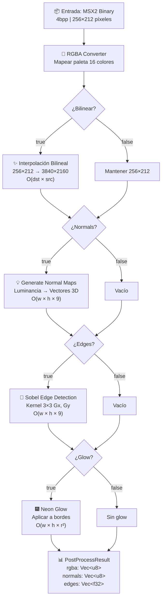

---

## 📐 Interpolación Bilineal

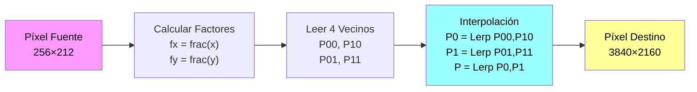

---

## 💡 Generación Normal Maps

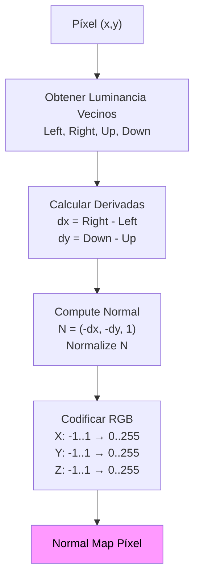

---

## 🌟 Detección Sobel

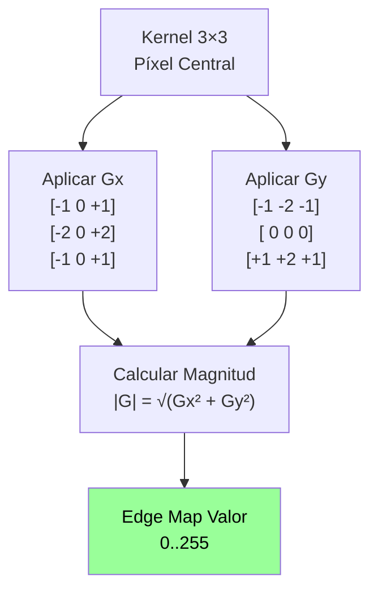

---

## 🎆 Neon Glow Application

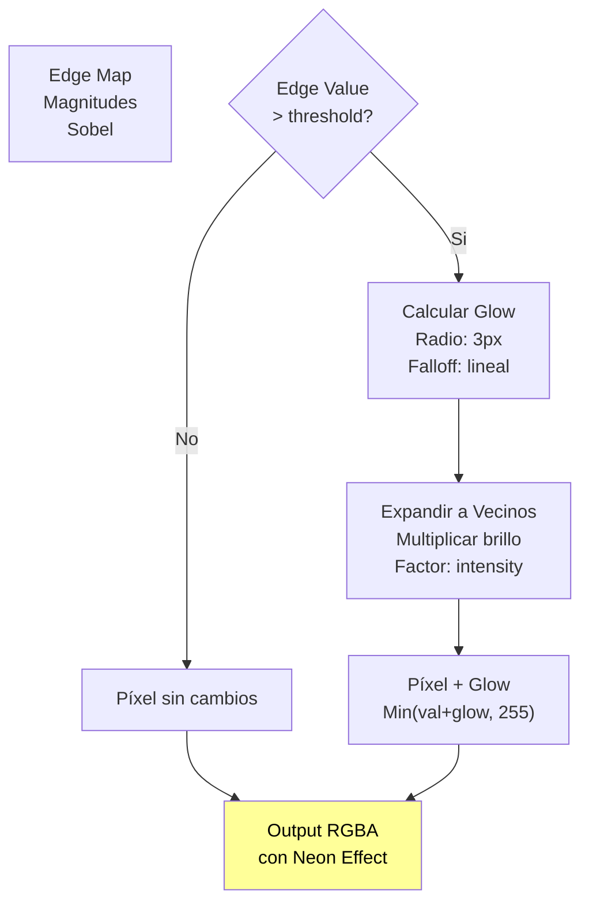

---

## 🔄 Loop en Tiempo Real

```mermaid
graph LR
    A["Frame N<br/>MSX2 Binary"]
    B["Process<br/>Post-Effects"]
    C["Render<br/>Canvas/WebGL"]
    D["Frame N+1"]
    
    A --> B --> C --> D
    
    loop Cada 33ms ~30FPS
    end
    
    style A fill:#9ff,color:#000
    style C fill:#f9f,color:#000
```

---

## 📊 Arquitectura de Datos

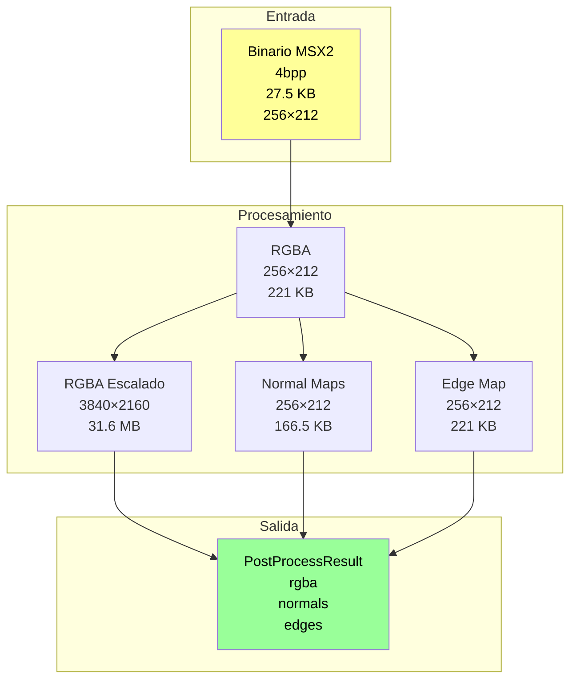

---

## 🎯 Pipeline de Shader WebGL

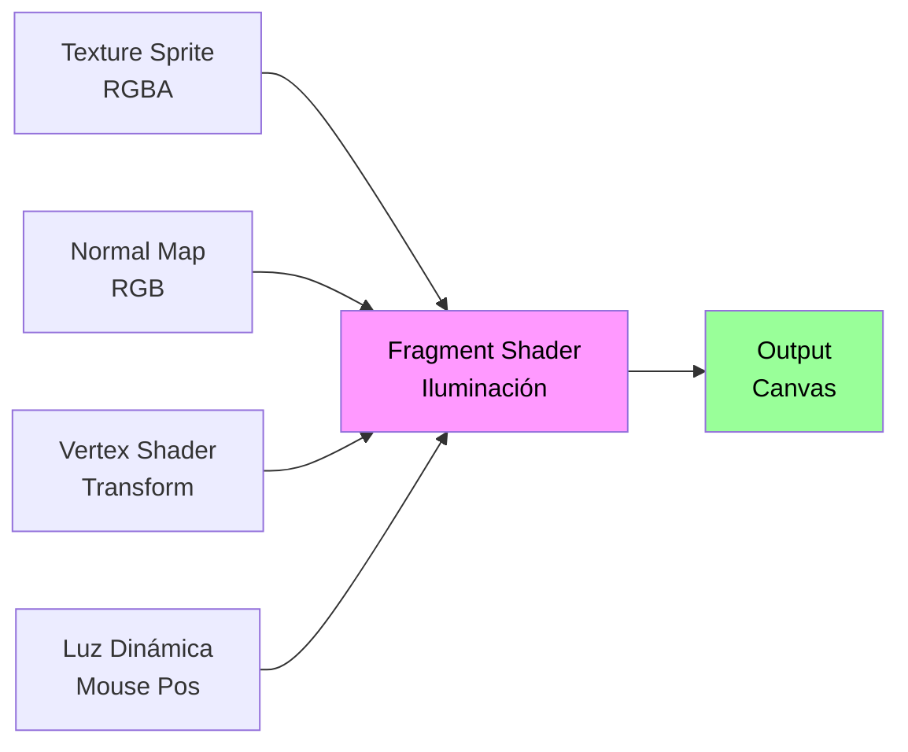

---

## ⚡ Complejidad Computacional

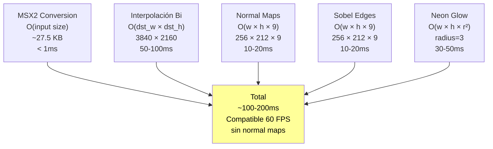

---

## 🎨 Flujo Integración Web

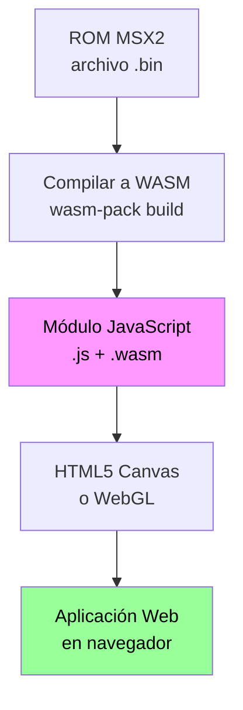

---

## 📈 Perfil de Memoria

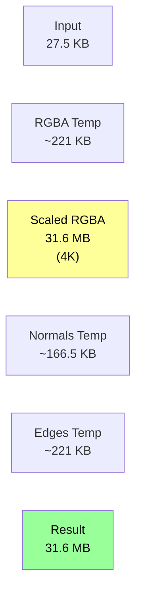

---

## 🔀 Rutas CondicionalES del Proceso

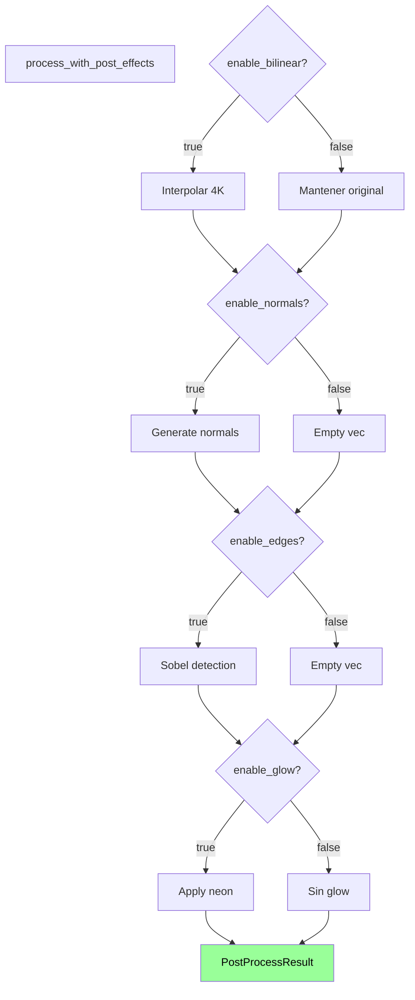

---

*Diagramas generados con Mermaid.js*
*© 2026 PAPIWEB DESARROLLOS INFORMATICOS*
