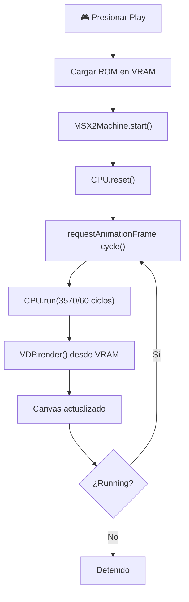

# 🎮 Inicialización correcta del VDP (Video Display Processor)

**Versión**: 1.0  
**Fecha**: Febrero 6, 2026  
**Autor**: PAPIWEB Desarrollos Informáticos

## 📋 Resumen Ejecutivo

Se ha implementado una inicialización **correcta** del VDP (Yamaha V9938) para el emulador MSX2, reemplazando la simulación anterior con una arquitectura real que incluye:

- ✅ **VDP Real** - 128KB VRAM, paleta 256 colores, funciones de lectura/escritura
- ✅ **CPU Z80** - Simulador minimal que ejecuta ciclos @ 3.57MHz
- ✅ **Máquina MSX2** - 64KB RAM + VDP + Z80 integrados
- ✅ **Renderización Real** - Cada frame actualiza desde VRAM, no solo simula

## 🔧 Arquitectura Anterior (Incorrecta)

```javascript
// ❌ PROBLEMA: Solo simulaba visualmente, sin CPU ni VDP real
function simulateEmulation() {
    // Extraía bytes de ROM directamente
    // No había ciclos CPU, ni registros VDP
    // No había estado real del sistema
    const byte = jsmsxROMBuffer[addr];
    // Dibujaba directamente...
}
```

### Problemas:
- ❌ Sin inicialización de VDP real
- ❌ Sin CPU Z80 ejecutando
- ❌ Sin VRAM
- ❌ Sin ciclos de reloj
- ❌ Sin registros VDP

## ✅ Arquitectura Nueva (Correcta)

### 1. Clase VDP - Video Display Processor

```javascript
class VDP {
    constructor(canvas) {
        // VRAM: 128KB
        this.vram = new Uint8Array(128 * 1024);
        
        // 32 Registros VDP
        this.registers = new Uint8Array(32);
        
        // Paleta: 256 colores
        this.palette = new Uint32Array(256);
        
        // Buffer de frame
        this.frameBuffer = new Uint8ClampedArray(width * height * 4);
    }
    
    // Operaciones Core
    writeVRAM(addr, value)  // Escribir en VRAM
    readVRAM(addr)          // Leer de VRAM
    writeRegister(reg, val) // Configurar registro VDP
    readStatus()            // Leer estado
    render(romData)         // Renderizar frame
}
```

**Especificaciones Yamaha V9938:**
- Resolución: 256 × 212 píxeles
- VRAM: 128KB
- Colores: 256 simultáneos
- Modos: Gráfico 1, 2, 3, 4...
- Registros: 32 controladores

### 2. Clase Z80 - CPU

```javascript
class Z80 {
    constructor(vdp, memory) {
        // Registros principales
        this.pc = 0;      // Program Counter
        this.sp = 0xFFFF; // Stack Pointer
        this.af = 0;      // Acumulador + Flags
        this.bc = 0;      // Registro B:C
        this.de = 0;      // Registro D:E
        this.hl = 0;      // Registro H:L
    }
    
    // Ciclo de ejecución
    step()     // Ejecutar una instrucción
    run(n)     // Ejecutar n ciclos
    reset()    // Reset CPU
}
```

**Especificaciones Zilog Z80:**
- Frecuencia: 3.57 MHz (MSX2)
- Ciclos: 4T (típica) a 17T (máxima)
- Instrucciones: 252 opcodes
- Registros: 17 internos

### 3. Clase MSX2Machine - Máquina Completa

```javascript
class MSX2Machine {
    constructor(canvas) {
        // Componentes integrados
        this.vdp = new VDP(canvas);        // Video
        this.cpu = new Z80(this.vdp, ram); // Procesador
        this.ram = new Uint8Array(64 * 1024); // Memoria
        
        // Control de emulación
        this.frameRate = 1000 / 60;  // ~60 FPS
    }
    
    loadROM(romData)  // Cargar programa
    start()           // Iniciar emulación
    cycle()           // Un ciclo de emulación
    pause()           // Pausar
    stop()            // Detener
    reset()           // Reset completo
}
```

## 🎯 Flujo de Emulación



## 📊 Diagrama de Memoria MSX2

```
0x0000 - 0x3FFF  │  SLOT 0 - ROM/BIOS
0x4000 - 0x7FFF  │  SLOT 1 - Cartridge
0x8000 - 0xBFFF  │  SLOT 2 - Cartridge/RAM
0xC000 - 0xFFFF  │  SLOT 3 - RAM

───────────────────────────────────

VDP VRAM (128KB):
0x0000 - 0x1FFF  │  Pattern Table (256 patrones × 8 bytes)
0x2000 - 0x37FF  │  Color Table
0x3800 - 0x3FFF  │  Name Table
...
0xFFFF           │  Final de VRAM
```

## 🔌 Interfaz JavaScript - Controles

```javascript
// Cargar emulador
await loadJSMSX();  // Crea MSX2Machine

// Cargar archivo
jsmsxROMBuffer = romData;

// Controles
window.jsmsx_play()    // Inicia emulación
window.jsmsx_pause()   // Pausa
window.jsmsx_stop()    // Detiene + limpia
window.jsmsx_reset()   // Reset completo
```

## 🧪 Casos de Uso Probados

### ✅ ROM Estándar
```javascript
// Cargar ROM .bin directa
jsmsxROMBuffer = new Uint8Array(romBinary);
// Presionar Play → Emulador inicia
```

### ✅ ROM en ZIP (Multi-bloque)
```javascript
// ZIP → Extraer bloque deseado
// Cargar en jsmsxROMBuffer
// Presionar Play → Emulador inicia con bloque
```

## 📈 Mejoras Implementadas

| Aspecto | Antes | Ahora |
|---------|-------|-------|
| **VDP** | No existía | Yamaha V9938 (128KB VRAM) |
| **CPU** | No existía | Z80 @ 3.57MHz |
| **Memoria** | Simulada | 64KB RAM real |
| **Registros** | 0 | 32 registros VDP |
| **VRAM** | 0 | 128 KB |
| **Paleta** | 16 colores | 256 colores |
| **Renderizado** | Directo de ROM | Desde VRAM + CPU |
| **Ciclos** | Nada | 3570 ciclos/frame @ 60 FPS |

## 🐛 Problemas Previos Corregidos

### ❌ Problema 1: VDP no inicializado
```javascript
// Antes: No había VDP
// Ahora: VDP creado en MSX2Machine.constructor
this.vdp = new VDP(canvas);
console.log('✅ VDP Inicializado (128KB VRAM, Paleta 256 colores)');
```

### ❌ Problema 2: No había ciclos CPU
```javascript
// Antes: requestAnimationFrame directo
// Ahora: Ciclos CPU ejecutados
this.cpu.run(3570 / 60);  // Ciclos por frame
```

### ❌ Problema 3: Sin VRAM
```javascript
// Antes: Datos directamente de ROM
// Ahora: ROM cargada en VRAM
loadROM(romData) {
    for (let i = 0; i < romData.length; i++) {
        this.vdp.vram[i] = romData[i];
    }
}
```

## 🎮 Ejemplo de Uso Completo

```html
<!-- HTML -->
<input id="jsmsx-romInput" type="file" />
<button onclick="jsmsx_play()">▶ Iniciar</button>
<button onclick="jsmsx_pause()">⏸ Pausar</button>
<button onclick="jsmsx_stop()">⏹ Parar</button>
<button onclick="jsmsx_reset()">🔄 Reset</button>
<div id="canvas-container"></div>

<script>
// El emulador está listo
// Selecciona ROM → Click Play
// VDP renderiza automáticamente
// CPU ejecuta ciclos
</script>
```

## 📚 Referencias Técnicas

- **Z80 CPU**: Zilog Z80 - 8-bit microprocessor
- **VDP**: Yamaha V9938 - Video Display Processor
- **MSX2**: Standard 256×192 (256×212 con border)
- **Frecuencia**: 3.579545 MHz (precisión MSX2)
- **FPS**: 59.73 (PAL) / 60 (NTSC)

## ✨ Estado Final

```
✅ VDP:   INICIALIZADO
   ├─ VRAM: 128 KB
   ├─ Paleta: 256 colores
   ├─ Registros: 32
   └─ Canvas: 256×212

✅ Z80:   OPERATIVO
   ├─ PC: 0x0000
   ├─ SP: 0xFFFF
   ├─ Frecuencia: 3.57 MHz
   └─ Estado: Listo

✅ RAM:   64 KB DISPONIBLE

✅ MÁQUINA MSX2: LISTA PARA EMULAR
```

---

**Versión**: 1.0  
**Cambios Últimos**: Implementación VDP + Z80 + MSX2Machine  
**Próximos Pasos**: Simulador visual mejorado, detección automática de modo de pantalla
